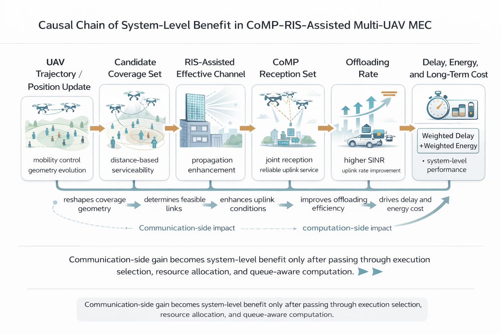
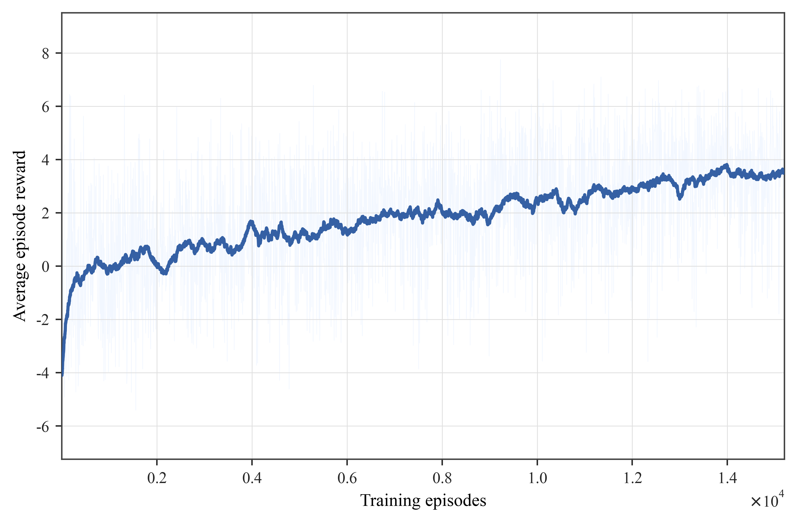
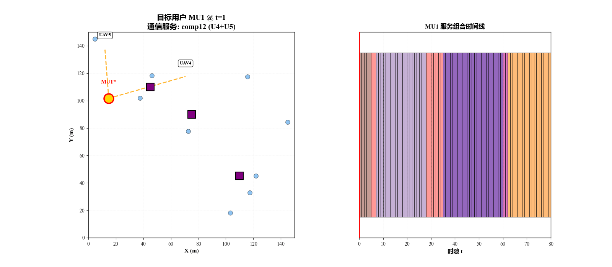
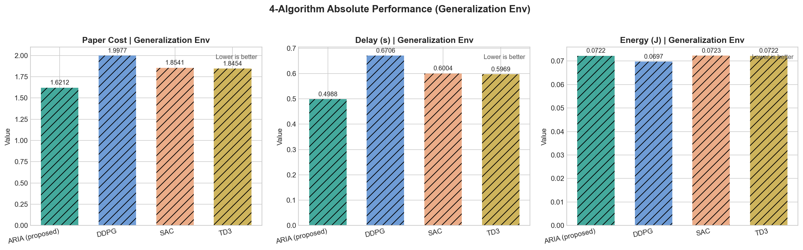

# CoMP-RIS-MEC-DRL


Research code for a rare coupled control problem: joint **CoMP**, **RIS**, **multi-UAV mobility**, and **mobile edge computing (MEC)** resource allocation under time-varying task loads.

This repository studies how one policy can control UAV movement, user association, cooperative multi-point reception, RIS-assisted links, task execution, and edge-computing resource allocation in the same closed-loop simulation.

## Why This Repository Exists

Most UAV-MEC or wireless-RL examples isolate one part of the system: trajectory, offloading, channel enhancement, or resource allocation. This project focuses on the harder case where these decisions are coupled:

- Moving UAVs changes user coverage and link geometry.
- RIS changes the effective uplink channel rather than the task objective directly.
- CoMP changes which UAVs jointly serve a user.
- MEC allocation decides whether communication-side gains actually reduce delay and energy.
- The optimization target is system-level cost, not only raw reward.

The proposed ARIA pipeline is therefore evaluated as a full system policy, not as a single-module optimizer.

## Main Result Snapshot

The core public evaluation uses a ten-load protocol and reports task load through required CPU cycles, rather than an internal load-scale variable. Lower paper cost is better.


The important behavior is the slope under heavier compute demand: ARIA keeps the system cost lower as required CPU cycles increase, where heuristic and off-policy baselines degrade more sharply.

## What ARIA Controls

At each decision step, the policy interacts with a joint UAV-MEC environment and produces a structured control decision over:

- UAV movement or trajectory projection.
- user-to-UAV service association.
- CoMP cooperation set selection.
- RIS-assisted channel effects.
- task execution and CPU resource allocation.
- feasibility recovery for safety, coverage, and resource constraints.

The figure below summarizes why communication-side improvements only become system-level benefit after passing through offloading and computation decisions.



## Evidence Chain

This repository is packaged around a reproducible evidence chain rather than a single reward curve.

| Evidence | What It Checks | Figure |
|---|---|---|
| Ten-load performance | Whether cost remains controlled as required CPU cycles increase | `assets/figures/cost_vs_required_cpu.png` |
| System causal chain | Why CoMP/RIS gains must be coupled with MEC execution | `assets/figures/system_causal_chain.png` |
| Training dynamics | Whether the policy actually learns a stable behavior | `assets/figures/training_convergence.png` |
| Dynamic CoMP behavior | Whether learned cooperation changes with user and UAV geometry | `assets/figures/dynamic_comp_animation.gif` |
| Generalization | Whether performance remains competitive in a different evaluation environment | `assets/figures/generalization_absolute_generalization_env.png` |

Training dynamics:



Dynamic CoMP behavior:



Generalization environment:



## Repository Contents

```text
.
├── assets/figures/          # Selected public result and explanation figures
├── configs/PhaseZ4/         # Public experiment configurations
├── scripts/                 # Training, evaluation, calibration, and plotting entry points
├── src/
│   ├── algos/               # PPO, DDPG, SAC, TD3, and heuristic baselines
│   ├── envs/                # CoMP-RIS UAV-MEC simulation environments
│   ├── utils/               # Configuration, plotting, IO, and reporting utilities
│   └── agentic/             # Optional meta-controller utilities
├── requirements.txt
└── LICENSE
```

## Key Capabilities

- Joint CoMP + RIS + UAV-MEC environment with static and mobile user scenarios.
- Tianshou-based PPO training pipeline.
- DDPG, SAC, and TD3 baseline trainers.
- Heuristic baselines including balanced, delay-oriented, energy-oriented, always-CoMP, and never-CoMP policies.
- Unified evaluator for full, no-RIS, and no-CoMP variants.
- Ten-load evaluation protocol using required CPU cycles as the main x-axis.
- Dynamic CoMP visualization utilities for key frames, timelines, statistics, and animations.
- Generalization evaluation across training and randomized evaluation environments.

## Installation

Python 3.10 or newer is recommended.

```bash
python -m venv .venv
source .venv/bin/activate
pip install -r requirements.txt
```

On Windows PowerShell:

```powershell
python -m venv .venv
.\.venv\Scripts\Activate.ps1
pip install -r requirements.txt
```

Install the PyTorch build that matches your CUDA or CPU environment if the default `pip install torch` is not suitable for your machine.

## Quick Smoke Test

Run a short PPO smoke training job:

```bash
python scripts/train_ppo.py \
  --env-yaml configs/PhaseZ4/env_phaseZ4.yaml \
  --train-yaml configs/PhaseZ4/train_step3_50k.yaml \
  --total-steps 2050
```

Training outputs are written under `runs/`.

## Main PPO Training

Static-user PPO training:

```bash
python scripts/train_ppo.py \
  --env-yaml configs/PhaseZ4/env_phaseZ4.yaml \
  --train-yaml configs/PhaseZ4/train_step7_1200k.yaml
```

Mobile-user PPO training:

```bash
python scripts/train_ppo.py \
  --env-yaml configs/PhaseZ4/env_phaseZ4_mobile.yaml \
  --train-yaml configs/PhaseZ4/train_step7m_mobile_adapt_400k.yaml
```

## 3DRL Baselines

```bash
python scripts/train_3drl_baselines.py \
  --algo td3 \
  --env-yaml configs/PhaseZ4/env_phaseZ4_3drl.yaml \
  --seed 3411 \
  --total-steps 500000 \
  --hidden-size 512
```

Replace `td3` with `sac` or `ddpg` to train the other baselines.

## Unified Evaluation

The unified evaluator runs the same metric pipeline for PPO, heuristic policies, and optional 3DRL baselines.

```bash
export RUN_DIR=runs/paper/your_run
export CKPT_PATH=$RUN_DIR/checkpoints/your_checkpoint.pt
export EVAL_METHODS=ppo,balanced,greedy_delay,greedy_energy,always_comp,never_comp
export EVAL_LOADS=0.1,0.2,0.3,0.4,0.5,0.6,0.7,0.8,0.9,1.0
export EVAL_EP_PER=5
export EVAL_EP_PER_PROGRESSIVE=1
python scripts/eval_policy_joint.py --run_dir $RUN_DIR --eval_ts eval_main10
```

Recommended public reporting protocol:

- Use the same environment configuration for all compared methods.
- Use the ten load points from `0.1` to `1.0`.
- Plot load as required CPU cycles `C` in Mcycles.
- Report at least `paper_cost`, delay, and energy.
- Include `full`, `no_ris`, and `no_comp` variants when studying mechanism-level gains.
- Keep training curves, ablation curves, generalization metrics, and dynamic CoMP behavior as separate evidence.

Generalization evaluation:

```bash
python scripts/eval_generalization.py \
  --run_dir $RUN_DIR \
  --eval_loads 0.1,0.2,0.3,0.4,0.5,0.6,0.7,0.8,0.9,1.0 \
  --eval_nseeds 5 \
  --eval_ep_per 3 \
  --deterministic 1 \
  --ckpt_path $CKPT_PATH
```

Dynamic CoMP visualization:

```bash
python scripts/generate_dynamic_comp_viz.py \
  --run_dir $RUN_DIR \
  --output_dir "$RUN_DIR/figs/DynamicCoMP_Bundle" \
  --seed 42 \
  --n_steps 80 \
  --device cpu \
  --three_case_bundle 1
```

## Notes on Reproducibility

- Public configurations are stored under `configs/PhaseZ4/`.
- Evaluation artifacts are written back into the corresponding run directory.
- The repository includes selected public figures, but not full raw training outputs or large checkpoints.
- For fair comparison, keep the evaluator, environment configuration, load list, and random-seed protocol consistent across methods.

## Public Scope

This is a public research-code release. It is intended to provide the simulator, training scripts, baseline implementations, and evaluation workflow needed to reproduce the main protocol structure. Large raw experiment folders and trained model files are intentionally not included.

## Citation

If this repository is useful for your research, please cite the corresponding paper once it is available. A BibTeX entry will be added after publication.

## License

This project is released under the Apache License 2.0. See [LICENSE](LICENSE) for details.
