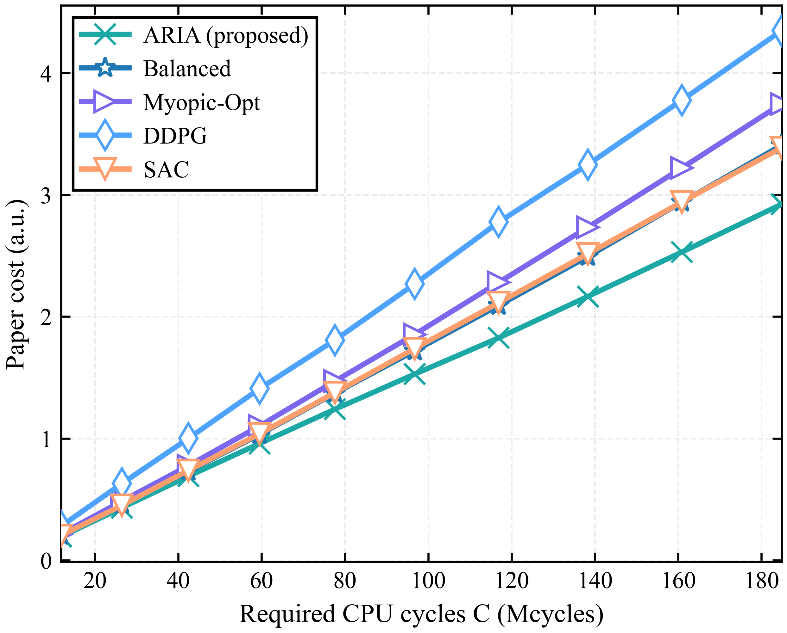
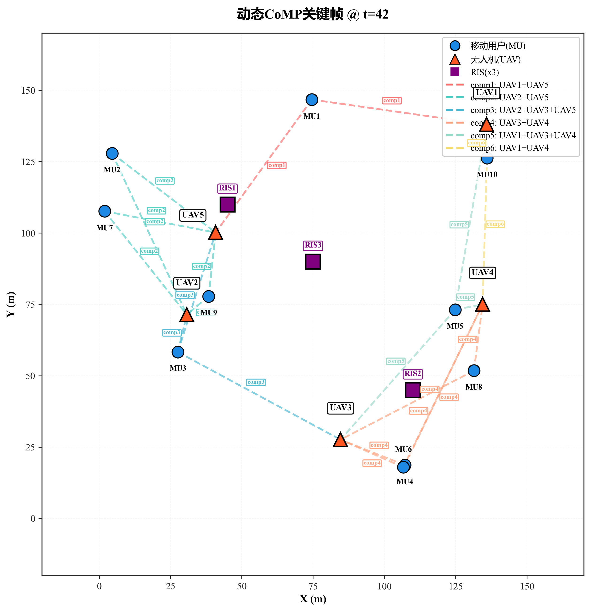
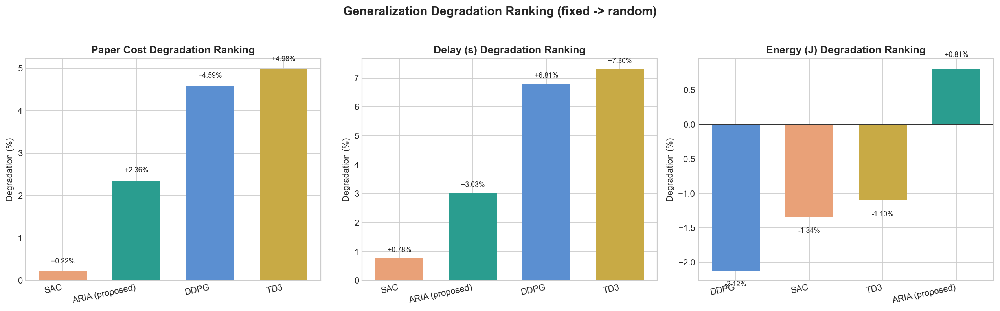

# CoMP-RIS-MEC-RL

Reinforcement-learning simulation code for joint trajectory, communication, and resource allocation in a UAV-assisted mobile edge computing (MEC) system with coordinated multi-point transmission (CoMP) and reconfigurable intelligent surfaces (RIS).

The repository contains the public simulation code used to study how a policy can jointly control UAV movement, user association, CoMP cooperation, RIS-assisted links, and edge-computing resource allocation under varying task loads.

## Highlights

- Joint CoMP + RIS + UAV-MEC environment with configurable static and mobile user scenarios.
- PPO training pipeline based on Tianshou.
- DDPG, SAC, and TD3 baseline trainers.
- Unified evaluation over full, no-RIS, and no-CoMP variants.
- Ten-load evaluation protocol using required CPU cycles as the main load axis.
- Dynamic CoMP visualization utilities for key frames, timelines, and animations.

## Example Results

Required-CPU-cycle evaluation:



Dynamic CoMP key frame:



Generalization comparison:



## Repository Structure

```text
.
├── assets/figures/          # Selected public result figures
├── configs/PhaseZ4/         # Public experiment configurations
├── scripts/                 # Training, evaluation, and plotting entry points
├── src/
│   ├── algos/               # PPO, DDPG, SAC, TD3, and heuristic baselines
│   ├── envs/                # CoMP-RIS UAV-MEC simulation environments
│   ├── utils/               # Shared configuration, plotting, and IO utilities
│   └── agentic/             # Optional meta-controller utilities
├── requirements.txt
└── LICENSE
```

## Installation

Python 3.10 or newer is recommended.

```bash
python -m venv .venv
source .venv/bin/activate
pip install -r requirements.txt
```

On Windows PowerShell:

```powershell
python -m venv .venv
.\.venv\Scripts\Activate.ps1
pip install -r requirements.txt
```

Install the PyTorch build that matches your CUDA or CPU environment if the default `pip install torch` is not suitable for your machine.

## Quick Smoke Test

Run a short PPO smoke training job:

```bash
python scripts/train_ppo.py \
  --env-yaml configs/PhaseZ4/env_phaseZ4.yaml \
  --train-yaml configs/PhaseZ4/train_step3_50k.yaml \
  --total-steps 2050
```

Training outputs are written under `runs/`.

## Main PPO Training

Static-user PPO training:

```bash
python scripts/train_ppo.py \
  --env-yaml configs/PhaseZ4/env_phaseZ4.yaml \
  --train-yaml configs/PhaseZ4/train_step7_1200k.yaml
```

Mobile-user PPO training:

```bash
python scripts/train_ppo.py \
  --env-yaml configs/PhaseZ4/env_phaseZ4_mobile.yaml \
  --train-yaml configs/PhaseZ4/train_step7m_mobile_adapt_400k.yaml
```

## 3DRL Baselines

```bash
python scripts/train_3drl_baselines.py \
  --algo td3 \
  --env-yaml configs/PhaseZ4/env_phaseZ4_3drl.yaml \
  --seed 3411 \
  --total-steps 500000 \
  --hidden-size 512
```

Replace `td3` with `sac` or `ddpg` to train the other baselines.

## Evaluation

The unified evaluator reads the run directory and evaluates PPO, heuristic methods, and optional 3DRL checkpoints.

```bash
export RUN_DIR=runs/paper/your_run
export CKPT_PATH=$RUN_DIR/checkpoints/ckpt_best.pt
export EVAL_METHODS=ppo,balanced,greedy_delay,greedy_energy,always_comp,never_comp
export EVAL_LOADS=0.1,0.2,0.3,0.4,0.5,0.6,0.7,0.8,0.9,1.0
export EVAL_EP_PER=5
export EVAL_EP_PER_PROGRESSIVE=1
python scripts/eval_policy_joint.py --run_dir $RUN_DIR --eval_ts eval_main10
```

Generalization evaluation:

```bash
python scripts/eval_generalization.py \
  --run_dir $RUN_DIR \
  --eval_loads 0.1,0.2,0.3,0.4,0.5,0.6,0.7,0.8,0.9,1.0 \
  --eval_nseeds 5 \
  --eval_ep_per 3 \
  --deterministic 1 \
  --ckpt_path $CKPT_PATH
```

Dynamic CoMP visualization:

```bash
python scripts/generate_dynamic_comp_viz.py \
  --run_dir $RUN_DIR \
  --output_dir "$RUN_DIR/figs/DynamicCoMP_Bundle" \
  --seed 42 \
  --n_steps 80 \
  --device cpu \
  --three_case_bundle 1
```

## Notes on Reproducibility

- Main evaluation should use the ten-load protocol from `0.1` to `1.0`.
- Evaluation figures report load through required CPU cycles rather than raw `load_scale`.
- Checkpoints and full raw training outputs are not included in this public repository.

## Citation

If this code is useful for your work, please cite the corresponding paper once it is available. A BibTeX entry will be added after publication.

## License

This project is released under the Apache License 2.0. See [LICENSE](LICENSE) for details.
